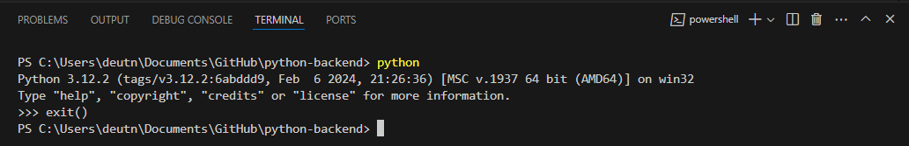
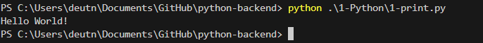

1- Abrir o terminal
2- Escrever python no terminal para que o intrepretador de python seja chamado
3- Depois, escrever exit() para voltar ao terminal do powershell de execução

4- para chamar o script, escrever python .\pasta\arquivo.py
exemplo: .\1-Python\1-print.py

